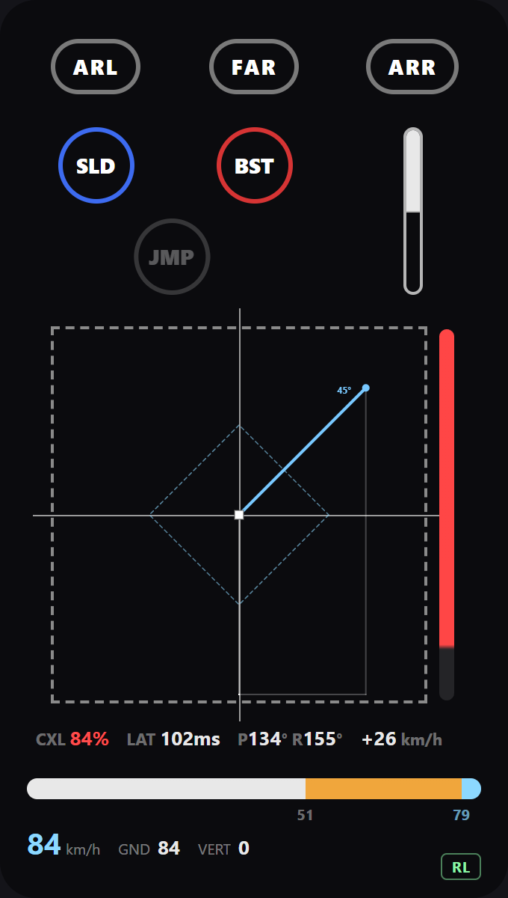

# RL Input Overlay

A live input overlay for Rocket League — throttle, boost, drift, air roll, flips.
It reads the game itself, so it shows the **action the game resolved**, not the
button you pressed.

<p align="center">
  
</p>

*A still can't carry the timeline's time dimension — `npm run clips` films it.
This one is regenerated by `npm run shot`, from the same replayed speed flip.*

In motion, over a real game:

https://github.com/user-attachments/assets/d90558ab-c0d5-42ad-bf57-f8b98313830d

**Windows, Rocket League + BakkesMod.** Nothing else to install.

## Install

### 1. The plugin

[**Input Bridge** on bakkesplugins.com](https://bakkesplugins.com/plugin/875) —
one click, and BakkesMod keeps it updated.

This is the data source: it reads the game and publishes on a local WebSocket.
It draws nothing by itself. By hand instead: put `RLOverlayPlugin.dll` in
`%APPDATA%\bakkesmod\bakkesmod\plugins\`, and `plugin load rloverlayplugin` in
`%APPDATA%\bakkesmod\bakkesmod\cfg\plugins.cfg`.

### 2. The overlay

From [the latest release](https://github.com/MCopin/rl-input-overlay/releases/latest):

| File | |
|---|---|
| `RL Input Overlay Setup <version>.exe` | installs, adds a Start-menu entry |
| `RL Input Overlay <version> portable.exe` | runs as it is, installs nothing |

Both are unsigned, so Windows SmartScreen will say *unknown publisher* the first
time: **More info → Run anyway**.

### 3. Set Rocket League to Borderless

The overlay is an always-on-top window drawn over the game by Windows, and
nothing composites over exclusive fullscreen — that's the display driver's call,
no setting fixes it. Borderless fills the screen just the same and costs next to
nothing on Windows 11.

*(Want the overlay in your stream only, and keep exclusive fullscreen? See
[OBS](#obs) below.)*

### That's it

Launch order doesn't matter: whichever starts first waits for the other. The
configuration window says whether the bridge is alive — while it's silent, the
overlay has nothing to show, and shows nothing rather than inventing.

## Shortcuts

| Shortcut | Action |
|---|---|
| `Ctrl+Shift+O` | Show / hide the overlay |
| `Ctrl+Shift+E` | Edit mode (move / resize the overlay window) |
| `Ctrl+Shift+L` | Change layout |

`Ctrl+Shift+L` cycles five layouts so you can try them in game; the name shows
for a second at the top, and the choice is kept. The default, `checker`, merges
the three bands into one grid with the throttle gauge standing vertically on the
right. The other four only reorder the bands — and only in the orders that keep
the throttle gauge against the button band, since it comments on what those
buttons do.

## What it shows

- **Buttons and sticks** — the actions the game resolved, so bindings are
  irrelevant. Deadzone, dodge threshold and the two sensitivities are read back
  from Rocket League every second: change them in the menus and the overlay
  follows on its own.
- **Flip timeline** — a cancel isn't a percentage but a profile. The game
  recomputes on every tick how much torque it suppresses, so you can cut at the
  start, at the end, or in fits and starts. The bar carries pitch torque across
  the 0.65 s window: red where it was suppressed, transparent where it was
  delivered. Below it: cancel %, latency, the pitch/roll split, and the speed
  gain of the impulse. Physics and sources in [`docs/flip.md`](docs/flip.md).
- **`FLIP` indicator** — appears only while airborne, gone the moment the flip
  is lost. Its fill carries the second-jump countdown, and **only if you left the
  ground by jumping**: off a ramp or a ledge there is no clock, and it stays full
  until you land. `HasFlip()` comes from the game, so flip resets are right.
- **Speed bar** — graduated on the game's own thresholds: white to 1410 uu/s
  (the ceiling without boost), amber to 2200 (supersonic), blue to 2300 (the
  car's ceiling). The 2100–2200 band is the supersonic hold.
- **Stick trail** — the stick's path stays readable for a few seconds.
- **First jump size** — `JMP` fills while held; full means `JumpForceTime`, past
  which holding adds nothing. The level reached stays up for a moment.

There is no controller-only fallback, on purpose: ground contact, speed and flip
availability are not in the inputs, and a flip reset puts them out of reach for
good. Guessing them would put wrong numbers on screen that nothing would
distinguish from a measurement — see [`docs/sources.md`](docs/sources.md).

## Known limitations

- **Changed game speed breaks the timers.** The windows the overlay counts
  itself — the second-jump countdown, the jump-hold gauge, the trail — run on
  the wall clock and assume the game runs at 1×. Slow the game down
  (BakkesMod's `gamespeed`, training slow-mo) and they no longer line up with
  the game's own windows. The flip timeline is the exception: it is sampled on
  the game's own clock and stays right at any speed.

## OBS

A browser source composites into the **stream**, never onto your own screen. To
see the overlay while you play, you need the app.

**With the app running** — add a Browser source on
`http://127.0.0.1:3947/overlay.html`. Transparent background, nothing else to set.

**Without the app** — download `rl-input-overlay-<version>.zip` from the
release, unzip it anywhere, then in OBS tick *Local file* and pick `overlay.html`.
The page talks straight to the plugin's WebSocket, so Rocket League with the
plugin loaded is all you need. You lose what only the app knows: the layout and
the trail duration keep their defaults.

> Needs plugin **1.0.1 or later**. OBS doesn't open a local file as `file://` —
> it serves it under a host of its own, `http://absolute/C:/…`. On 1.0.0, untick
> *Local file* and put a `file:///C:/…/overlay.html` URL in the URL field instead.
> Moved the port? Same field, with `?ws=127.0.0.1:<port>` appended.

## From source

```bash
cd app
npm install
npm start
```

| Script | |
|---|---|
| `npm run dist` | installer + portable, into `dist/app/` |
| `npm run pack` | the OBS archive, into `dist/` |
| `npm run actions` | unit checks on the frame → actions arithmetic |
| `npm run wire` | feeds the page frames both ways round and checks they agree |
| `npm run origins` | what the plugin's socket accepts and turns away (needs RL) |
| `npm run standalone` | checks the OBS archive works with no app |
| `npm run clips` | replays eleven flips and films them to `app/tools/clips/` |
| `npm run shot` | retakes the README screenshot, into `docs/overlay.png` |

`npm run clips` is the only way to check the flip timeline: a cancel is data that
lives in time, and a still capture only shows its final state. Expected values
are in [`docs/flip.md`](docs/flip.md).

The plugin builds separately, with the VS 2022 Build Tools — see
[`plugin/README.md`](plugin/README.md).

**Layout editor**: `http://127.0.0.1:3947/layout.html`, with the app running. It
measures the live overlay and turns it into draggable blocks, so the starting
point is always the layout as it is today. Export gives JSON to discuss; nothing
there modifies the overlay, the CSS stays hand-written.

## How it fits together

```
plugin/   BakkesMod plugin (C++) — reads the game, publishes JSON on ws://127.0.0.1:49200
app/      Electron overlay — one consumer of that protocol, not a requirement
docs/     protocol.md (the contract), architecture.md, flip.md, sources.md
```

The plugin doesn't know the app exists. It publishes
[a documented protocol](docs/protocol.md) and anything may read it — an overlay,
a stream graphic, a coaching tool, a script.

The page reaches it two ways: **through the app**, which relays frames unchanged
and adds what only it knows (the layout, the trail duration), or **straight to
the plugin** when `overlay.html` is opened from disk. Same parsing either way, in
`app/public/actions.js`. [`docs/architecture.md`](docs/architecture.md) walks the
whole thing.

## Credits & license

Inspired by maktuf's overlay — itself a mashup of
[Revela's Input HUD](https://bakkesplugins.com/plugin/764) and
[Controller Overlay](https://bakkesplugins.com/plugin/59) — with an added time
dimension (see [`notes.md`](notes.md)). Speed bar in the spirit of
[CinderBlocc's Speedometer](https://bakkesplugins.com/plugin/73).

MIT — see [`LICENSE`](LICENSE).
