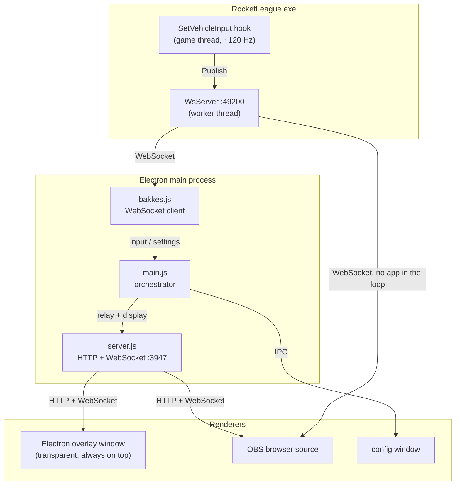
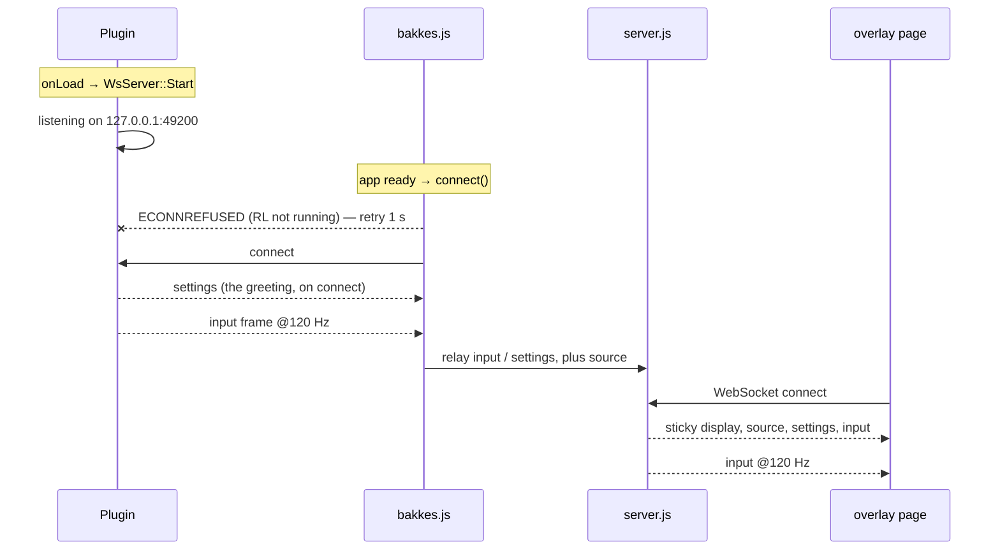

# Architecture

How a stick deflection inside Rocket League ends up drawn on screen.

The project is three programs that don't share a language: a C++ DLL living
inside the game, a Node/Electron process, and a web page. This document walks
the data down that chain, then covers what holds it together — the message
contract, the clocks, and the failure modes.

Three related documents: [`protocol.md`](protocol.md) is the contract this
plumbing carries — every field, its unit and its frame of reference;
[`sources.md`](sources.md) says *why* the game is the only source (and why the
controller path and replays were ruled out); [`flip.md`](flip.md) documents the
flip physics the overlay draws. This one is only about plumbing.

## The path



**One source, two ways to reach it.** The plugin publishes to a single
WebSocket server that anyone may read. A page served by the app reads the frames
the app relays, and gets the display settings only it knows — the chosen layout,
the trail duration, the flip numbers, the speed unit. A page opened as a file
connects to the plugin itself and
does without them; that's an OBS source with no Electron running at all.

The app is one client among several now, which is the change that mattered: for
a while the transport was a named pipe, a pipe serves exactly one client, and so
the app *had* to be the sole reader and relay to everyone else.

What matters is that the page parses the *same messages* either way. There is
one reading of the protocol, in [`app/public/actions.js`](../app/public/actions.js), and
one shaping. The app relays; it does not interpret.

There is still no fallback source. When nothing is talking, the overlay shows
stale values behind a `—` badge rather than inventing anything.

## 1. Inside the game — the plugin

`plugin/src/RLOverlayPlugin.cpp`, loaded by BakkesMod as an x64 DLL.

### The hook

```cpp
gameWrapper->HookEventWithCaller<CarWrapper>(
    "Function TAGame.Car_TA.SetVehicleInput",
    [this](CarWrapper car, void*, std::string) { OnSetVehicleInput(car); });
```

This fires **once per physics tick while you are driving**, with the car as
caller. Two filters run immediately: somebody must be listening
(`ws_->IsConnected()`), and the car must be the local one —
`gameWrapper->GetLocalCar()` compared by `memory_address`, otherwise a
spectated car would feed the overlay.

### What it reads

| Source | Fields | Why it can't come from anywhere else |
|---|---|---|
| `car.GetInput()` (`ControllerInput`) | throttle, steer, pitch, yaw, roll, dodge axes, handbrake, jump, boost | Actions **already resolved by the game**, so independent of the player's key bindings |
| `car.GetDodgeComponent()` | active time, direction, torque time, min torque time | The dodge as actually applied — the flip angle is read, not inferred from the stick |
| `car.GetJumpComponent()` | `GetJumpForceTime()` | The real hold window that modulates jump height (0.2 s), not a guessed constant |
| `car.GetBoostComponent()` | current boost amount | — |
| `car.IsOnGround()`, `car.HasFlip()` | ground contact, flip availability | `HasFlip()` is correct through flip resets, which no input reading could see |
| rotation / velocity / angular velocity | `rot`, `vel`, `angVel` | Depend on the field, bounces and bumps |

Two conversions happen in the plugin rather than downstream:

- **`RotToDeg`** — UE3 rotators are 16-bit-ish integers (`±32768` = half turn);
  the wire carries degrees.
- **`ToLocalRates`** — angular velocity arrives in world space, which cannot
  distinguish a pitch from a roll. The rotation is turned into a quaternion, the
  car's forward/right/up axes are rotated by it, and `angVel` is projected onto
  each. The `pitch` component (around the car's right axis) is what measures how
  far a forward flip actually turned, and therefore what a cancel leaves behind.

The result is `snprintf`'d into a fixed 1 KB buffer as one JSON object, and
handed to the server. Every field of it is documented in
[`protocol.md`](protocol.md) — it is a public contract now, not an internal
format.

### Settings, on their own clock

Controller settings must reach the overlay even when no car exists — in menus,
in the pause screen — so they can't ride the input hook. `ScheduleSettingsTick`
uses `gameWrapper->SetTimeout(…, 1.f)` and re-arms itself; BakkesMod purges a
plugin's timeouts on unload, so the loop stops by itself.

Each tick reads `GetGamepadSettings()` (deadzone, dodge threshold, steering and
air sensitivities) plus the full binding list, builds the JSON, and **skips the
send if it is byte-identical to the last one**.

That dedup would leave a client arriving between two changes with no settings at
all, so a changed blob goes out twice over: `PublishReliable` for whoever is
listening now, `SetGreeting` for whoever connects later. Replaying the greeting
is the server's job, since only it knows when a new client appears — and with
several clients possible, there is no single "has anyone connected" flag that
would do.

## 2. The transport

`plugin/src/WsServer.{h,cpp}` — RFC 6455 on `127.0.0.1:49200`, port on the
`rloverlay_ws_port` cvar, rebound on the spot when it changes.

**Written by hand rather than pulled from a library.** What this needs of the
protocol is a handshake, a text-frame encoder, and enough of the decoder to
notice a close and answer a ping — a few hundred lines. Vendoring websocketpp
and Asio for that would have cost the repository far more than it saved. SHA-1
comes from Windows CNG, so the DLL gains only `ws2_32` and `bcrypt`, both
shipped with the system: **the plugin has no dependency to fetch or build**,
which is what keeps it easy to hand to bakkesplugins.

### Why a worker thread

The game thread must never block on I/O. `Publish()` takes a mutex just long
enough to drop a string into a one-slot buffer and returns; the thread the
server owns does the actual sending. That is the contract: a client that stopped
reading costs a buffer, never a game tick.

Two publishing modes, and the difference matters:

| Method | Semantics | Used for |
|---|---|---|
| `Publish` | **Latest wins.** A frame overwrites the pending one | Input frames — a stale frame has no value once a newer one exists |
| `PublishReliable` | **Appended to a queue**, never dropped | Settings and bindings |
| `SetGreeting` | **Replayed to each client on connect** | The same settings, for whoever arrives later |

Reliable messages always go out *before* the pending frame, so the overlay knows
the deadzone before it has to interpret a stick value against it.

### What the implementation owes

- **One WebSocket message per JSON document.** No newlines, no length prefix, no
  back-channel: a message *is* one object, or the client can't parse it. That is
  why the reliable queue is a list of lines rather than one buffer.
- **Backpressure is per client.** Each has its own outbound buffer. Past 64 KB
  it stops being sent state — piling stale frames on a client that isn't reading
  is the opposite of latest-wins — while reliable messages keep going. Past 1 MB
  it isn't slow, it's gone, and the socket is closed.
- **`TCP_NODELAY`.** The frames are small and regular; letting Nagle hold one
  back waiting for the next would hand back as latency exactly what this
  transport exists to save.
- **Loopback bind and an `Origin` allowlist.** A listening TCP socket inside an
  online game is reachable from any page the user happens to visit. Browsers
  announce where they came from; only loopback hosts and `file://` are accepted,
  and a request with no `Origin` at all is taken as a non-browser client (a
  script, a probe), which is what `npm run wire` relies on.

  The host is compared **whole**, after the scheme, userinfo, port and path have
  been cut away. An earlier version tested it as a prefix, which accepted
  `http://localhost.evil.com` — a domain anybody can register. Prefix matching a
  hostname is not a shortcut for parsing it.

  `file://` pages report `Origin: null`, and so does a sandboxed iframe on a
  hostile page; nothing in the handshake can separate the two. Allowing it is
  what lets the overlay run off disk in an OBS source, so it stays on by
  default, and `rloverlay_ws_allow_file_origin 0` closes it for anyone not using
  that route.

  **OBS is a third form of the same thing.** obs-browser does not open a local
  file as `file://` — it serves it under a host of its own, `http://absolute/C:/…`
  (the string is in `obs-browser.dll`). So the page arrives on `http` with
  `Origin: http://absolute`, which is neither loopback nor a file, and was
  refused: the *Local file* checkbox never worked, before or after the host
  matching was tightened. It is now accepted in that exact form only, under the
  same switch — a local file wearing an http origin is still a local file.
  `http://absolute.evil.com` and `https://absolute` stay refused.

  The same disguise broke the page from the other end: `overlay.js` read "I am
  on http" as "the app is serving me" and asked `ws://absolute`. Being served
  over HTTP proves nothing; only a loopback *host* does. Both halves are pinned
  by tests now — `npm run origins` for the handshake, `npm run standalone` for
  the page, the latter replaying OBS's scheme rather than trusting `file://` to
  stand in for it.
- **`SO_EXCLUSIVEADDRUSE` on the listener.** Without it another local process
  can bind the same address with `SO_REUSEADDR` and take the connections meant
  for this one — a Windows-specific way for a listener to be impersonated.
- **A bound on what an unauthenticated peer can buffer.** The receive loop runs
  until the socket is dry, so without a cap a peer that keeps sending grows a
  buffer inside the game's process. Anything past a handshake's worth ends the
  connection.
- **A capped client count**, so an accept loop can't be turned into a memory
  leak from the outside.

### What it replaced

A named pipe at `\\.\pipe\rl-control-overlay`, retired once the WebSocket had
been measured against a live game. It worked, and two things about it are worth
remembering:

- **It served one client.** That single fact shaped the whole app: Electron had
  to be the sole reader and relay to everyone else. Making the plugin readable
  by anyone is what allows an OBS source with no app behind it.
- **`PIPE_ACCESS_DUPLEX`, not `OUTBOUND`.** Node's libuv always opens a pipe
  read+write; an outbound-only pipe answers it with `ENOENT`. That one cost an
  evening, and it is the kind of thing worth writing down even after deleting
  the code.

`git log` has it if it is ever needed again.

## 3. The Electron main process

### `bakkes.js` — the client

A `ws` client on `PLUGIN_WS` and a 1 s retry on close. `ECONNREFUSED` while RL
isn't running is swallowed silently rather than logged every second; `close`
follows an error, so the retry lives there and nowhere else. A message that
fails `JSON.parse` is dropped, not thrown.

The framing work that used to be here is gone: the transport delivers whole
messages, so there is no buffer to split and no truncated line to guard against.

That is all it does. It parses lines and emits them; it does **not** interpret
them. The shaping used to live here, and moving it out is what made a page
served by the app and a page wired straight to the plugin the same page.

### `main.js` — the orchestrator

Owns the two windows, the config file, the global shortcuts — and relays:

```js
bakkes.on('input', raw => server.broadcast(raw))
bakkes.on('settings', msg => server.broadcast(msg))
```

Verbatim, because the page reads the plugin's frames whether they arrive through
here or off the plugin's own socket. Translating would mean a second reading of
the protocol to keep in step with the page's, for nothing.

The app still adds two things of its own, and they are the reason it isn't a
plain proxy:

- **`display`** — trail duration, chosen layout, whether the flip numbers are
  shown, and the speed unit; all four are only known here. Each field is read so
  that a page that never receives the message keeps the default it already had.
  The unit travels as a name, not a factor: the conversion table lives in the
  page, so an app older than a unit cannot ask for one the page can't draw.
- **`source`** — whether the bridge to the game is alive. A page it serves
  can't tell from its own socket, since the app answers whether or not RL is
  running. A page wired straight to the plugin needs no such message: there, the
  socket being up *is* the answer.

Config (`trailSeconds`, `flipNumbers`, `speedUnit`, `rowOrder`, `overlayBounds`)
lives in
`config.json` under `app.getPath('userData')`, rewritten whenever the overlay
window is moved or resized.

### `server.js` — HTTP + WebSocket on 3947

A static file server for `public/` (with a `startsWith(publicDir)` guard against
path traversal) and a `WebSocketServer` sharing the same port, so one URL serves
both the page and its data.

The one non-obvious piece is **sticky messages**:

```js
const STICKY = ['display', 'source', 'settings', 'input']
```

The last message of each kind is cached and replayed to every new client.
Without it, an OBS source added mid-session would sit with no layout, no
settings and no state until the next frame — and if RL isn't running, forever.

Two families go by: what the app decides (`display`, `source`, keyed on `type`)
and what the plugin said, relayed unchanged (`settings`, `input`, keyed on `t`)
— hence `kindOf`. The replay order is the array's: settings before the frame
that has to be shaped with them.

### The shaping — `app/public/actions.js`

The one place raw game values become displayable, and it lives with the page
because the page is what has to work through either route:

```js
function shape(v, deadzone, sens) {
  const a = Math.abs(v)
  if (a <= deadzone) return 0
  const normalized = (a - deadzone) / (1 - deadzone)
  return Math.sign(v) * Math.min(1, normalized * sens)
}
```

`ControllerInput` carries the *raw* stick deflection, including values under the
deadzone that the car never receives. The overlay shows what the car actually
gets: deadzone removed, remainder renormalised over `[0,1]`, sensitivity applied
as a linear multiplier, saturated at 1. Which sensitivity depends on context —
`steerSens` on the ground, `airSens` in the air.

`toActions()` then resolves the ambiguities a mapping alone cannot:

- **Powerslide vs free air roll** — the same button. `onGround` decides.
- **Directional air roll** — `ControllerInput.Roll` merges the dedicated binds
  *and* the free air roll (which copies steer into Roll while its button is
  held). ARL/ARR only light up when the handbrake button is *not* held,
  otherwise a powerslide would falsely trigger them.
- **Sign conventions** — positive pitch is nose-up, which is the stick pulled
  toward you, which is *down* on screen.

`dodgeThresholdShown()` sits here for the same reason: the dodge threshold is a
threshold on the **raw** stick while the overlay draws *shaped* values, so it is
pushed through `shape()` with air sensitivity — otherwise the ring drawn on the
stick grid wouldn't line up with the dot moving inside it. It has to stay next
to the shaping it must remain comparable with.

## 4. The renderer

`app/public/overlay.js`, served over HTTP and loaded by **two different consumers
from the same URL**:

| | Electron overlay window | OBS browser source |
|---|---|---|
| Loaded from | `http://127.0.0.1:3947/overlay.html` | same |
| Preload | `preload-overlay.js` → `window.overlayAPI` | none |
| Edit mode | yes (drag to move the window) | `window.overlayAPI` is undefined, block skipped |
| Transparency | Electron `transparent: true` | OBS composites the page background |

That is the whole compatibility story — the page feature-detects `overlayAPI`
and everything else is identical.

### Which socket

`endpoint()` decides, and the rule is one line: **served over HTTP, talk to the
app; opened as a file, talk to the plugin.** `?ws=host:port` overrides either
way.

The app is preferred when it is there because it carries the `display` messages
— go straight to the plugin from a page the app served and ⌘⇧L would stop
working. A `file://` page has no app to have served it, which is exactly the
OBS-without-Electron case, and it does without the layout settings.

The message handler stays thin:

| Message | Effect |
|---|---|
| `t: 'input'` | `rl = m`, then `handleState(toActions(m, settings))` |
| `t: 'settings'` | stored, and the dodge threshold reprojected |
| `type: 'display'` | trail length and layout |
| `type: 'source'` | the `RL` / `—` badge, in relayed mode only |

`rl = m` is worth a note: the frame **is** the game data. `dodgeT`, `dodgeDir`,
`rates`, `vel`, `rot` are already in it under those names, and the app used to
copy them into an `rl` half only to have them read back out. The renderer still
treats a missing `rl` as "the bridge is silent".

In direct mode there is no `source` message, so the badge follows the socket:
open means the plugin is there, which is the same thing.

`npm run wire` covers both routes — the clips harness injects straight into the
page and never touches a socket, so nothing else would.

### Two clocks

This is the part to understand before touching the renderer.

- **Data arrives** at the plugin's rate, ~120 Hz, and every message runs
  `handleState`.
- **Drawing happens** in a `requestAnimationFrame` loop, at display rate.

They are decoupled, and the split of responsibilities follows from that.
`handleState` does everything **edge-triggered** — jump press/release detection
(`jump >= 0.5 && prev < 0.5`), dodge start/end, pushing flip markers — because
those events would be missed if they were only sampled at frame rate. `render()`
does everything **level-triggered** — filling gauges from the latest state,
ageing the trail, redrawing the grid.

The corollary: anything edge-triggered depends on frames not being dropped, and
`Publish` is explicitly latest-wins. A press *and* release inside a single
dropped window would vanish.

Measured on the WebSocket against a live game, 12 s of freeplay: **118.9 Hz,
median gap 8 ms, p95 15 ms, worst 18 ms**. Getting there took one fix worth
remembering — waiting a fresh period on each turn compounds `select`'s
millisecond of overshoot, which measured 111 Hz and lost one frame in fourteen.
The send deadline now advances by exactly one period, so a late tick is followed
by a short wait. The remaining jitter is the Windows timer's, and it is the
trade: the old loop was regularly slow but regular, this one is on time with
occasional 15 ms gaps.

The other thing that can lower the rate is a client falling 64 KB behind, which
stops being sent state until it catches up. That one has not been observed.

`trackRealDodge` deserves a mention as the design in miniature: it watches
`rl.dodgeT` cross zero and reads `rl.dodgeDir` — the direction the game
committed to — instead of guessing a flip from stick position. The comment on it
is the project's thesis in one line: *the game gives us the applied dodge, we
infer nothing*.

## 5. Lifecycle



A page in direct mode collapses the middle: it connects to the plugin, gets the
greeting, and receives the same frames with nobody in between.

Either side can restart independently:

- **RL starts after the app** — the client is already retrying every second.
- **App restarts** — the server drops the closed socket and frees its slot. The
  greeting hands the new client its settings on arrival, without waiting for the
  1 Hz tick.
- **Plugin rebuilt** — `build.ps1` unloads over RCON before overwriting the DLL
  (BakkesMod keeps it open), rebuilds, reloads. `onUnload` joins the server
  thread before the socket is closed, so the port is free by the time the new
  instance binds it; if it weren't, the retry loop would cover the gap anyway.
- **Overlay page reloaded** — sticky messages restore it immediately.

## 6. Ports, paths, names

| | Value | Where |
|---|---|---|
| Plugin WebSocket | `127.0.0.1:49200`, cvars `rloverlay_ws_port`, `rloverlay_ws_allow_file_origin` | `RLOverlayPlugin.cpp`, `PLUGIN_WS` in `overlay.js` and in `bakkes.js` |
| App HTTP + WebSocket | `127.0.0.1:3947` | `main.js` |
| BakkesMod RCON | `127.0.0.1:9002` | `rcon.ps1` / `rcon.js` — build tooling only |
| Frame rate | 120 Hz | `kSendHz` |
| Settings rate | 1 Hz | `ScheduleSettingsTick` |
| Config file | `%APPDATA%\…\config.json` | `app.getPath('userData')` |
| Plugin DLL | `%APPDATA%\bakkesmod\bakkesmod\plugins\` | CMake `POST_BUILD` |

Everything binds to `127.0.0.1`. Nothing listens on an external interface.
49200 was picked to stay clear of the neighbours a BakkesMod user is likely to
already run — SOS on 49122, RocketLink on 49124.

## 7. Failure modes

| Symptom | Cause | Where to look |
|---|---|---|
| Badge shows `—`, overlay frozen | RL not running, plugin not loaded, or nothing connected | BakkesMod console (F6): the plugin logs `[ws] listening on 127.0.0.1:49200`, then a line per client |
| Badge `RL`, but no settings-dependent behaviour | Settings never arrived | Each client is greeted on connect; `npm run wire` checks exactly this |
| A `file://` page shows nothing | The plugin isn't reachable on the default port | Check `rloverlay_ws_port` in the BakkesMod console, or pass `?ws=127.0.0.1:<port>` |
| A `file://` page is refused | `rloverlay_ws_allow_file_origin` is 0 | Set it back to 1, or serve the page over `http://127.0.0.1`. If a *hosted* page is refused, that's the `Origin` check doing its job — `npm run origins` shows exactly what is accepted |
| Stick moves but ARL/ARR never light | Free air roll button held | By design; see `toActions` |
| Nothing at all during a replay | The hook doesn't fire when not driving | By design — [`sources.md` §4](sources.md) |
| Countdowns drift in slow motion | Game speed ≠ 1× (`gamespeed`, training slow-mo): the second-jump countdown, the jump-hold gauge and the trail count wall time, and nothing in the protocol says how fast the game runs | Known limitation. Only the flip timeline survives a speed change — it is sampled on the game's own `dodgeT` |
| `plugin load` fails after a build | DLL was open | Unload first; that's what `build.ps1` does |

## 8. Known leftovers

- `PLUGINTYPE_FREEPLAY` in the `BAKKESMOD_PLUGIN` macro suggests a restriction
  that doesn't exist — per the BakkesMod wiki these flags are "a relic of an
  unrealized feature". The plugin's actual scope is set by the hook, not by that
  constant.

## 9. Adding a field, end to end

The chain is short but every link is manual. To surface a new game value:

1. **`RLOverlayPlugin.cpp`** — read it in `OnSetVehicleInput`, add it to the
   `snprintf` format string *and* its argument list (watch the 1 KB buffer;
   the write is skipped if the result would truncate).
2. **Nothing in the main process.** `bakkes.js` parses whatever arrives and
   `main.js` relays it untouched — that link is no longer manual.
3. **`overlay.js`** — read `rl.yourField`, in `handleState` if it is
   edge-triggered, in `render()` if it is level-triggered. Only touch
   `actions.js` if the value needs deadzone/sensitivity shaping.
4. **`overlay.html` / `overlay.css`** — the element and its style.
5. **`app/tools/flip-clips.js`** — if it participates in flips, add it to the
   synthetic frames so `npm run clips` keeps exercising it.

Rebuild the plugin with `.\plugin\build.ps1` (hot-reloads if RL is running);
the JS side only needs the app restarted.

One caveat that comes with the field names being on a public socket now: they
are an API the moment anyone else consumes them. Renaming one is no longer a
local edit.
