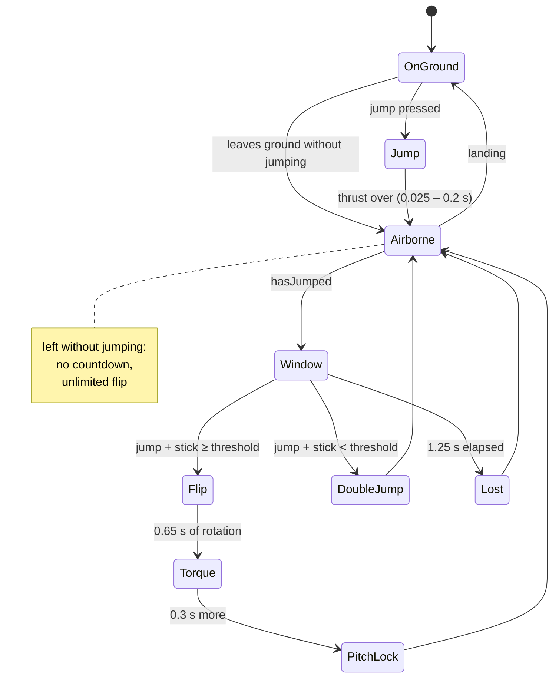
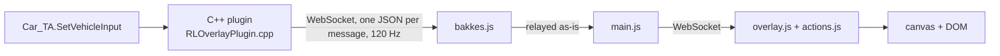

# Flip physics in Rocket League

A reference file: exactly what the game applies when you flip, what the overlay
can measure of it, and at what cost. Written before reworking the cancel
display, so that the representation follows from the mechanic and not the other
way round.

## Sources

Flip physics aren't documented by Psyonix. Two reimplementations are
authoritative, one derived from the other:

- [RocketSim](https://github.com/ZealanL/RocketSim) — replays RL's physics tick
  by tick, used for ML bot training. Files `src/RLConst.h` and
  `src/Sim/Car/Car.cpp`. All the code quoted here comes from it.
- [RLUtilities](https://github.com/samuelpmish/RLUtilities) — `src/simulation/car.cc`.
  RocketSim explicitly says it took inspiration from it for the flip.

They are checked here against measurements taken in game through BakkesMod (see
`notes.md`, section "Flip cancel measurements"). Agreement is good on the most
verifiable point — 204.8° predicted against 204° measured — which gives
confidence in the rest.

## 1. Frames and units

RL works in **unreal units** (uu). 1 uu ≈ 1.9 cm; the car is ~118 uu long, the
field 8192 × 10240 uu.

The car's frame, the one everything is computed in:

```
        ↑ Z  (up)     rotation about Z = yaw
        │
        │
        └───────→ X  (forward)   rotation about X = roll
       ╱
      ↙ Y  (right)               rotation about Y = pitch
```

A **positive pitch** puts the nose down (stick towards the top of the screen =
negative pitch on the input side, see §7). Angular velocities are in rad/s,
angular accelerations in rad/s².

## 2. Life cycle



The 1.25 s window (`DOUBLEJUMP_MAX_DELAY`) counts from the **end** of the first
jump, not from takeoff — detailed in `notes.md`, already applied in the overlay.

## 3. The input: dodge direction

```cpp
float inputMagnitude = abs(controls.yaw) + abs(controls.pitch) + abs(controls.roll);
bool isFlipInput = inputMagnitude >= config.dodgeDeadzone;
```

**The threshold is an L1 norm**, the sum of absolute values — not the Euclidean
norm. Direct consequence for the overlay: the "this stick triggers a flip" zone
is a **diamond**, not a circle. On the diagonal you flip at 0.35 of deflection
per axis when the threshold is 0.7, where a circle would require 0.5.

### It is a diamond on the *raw* stick, and only there

The rule reads `controls.*`, which is the raw deflection. The overlay draws the
**shaped** input — deadzone removed, sensitivity applied, saturated at 1 — and
the two spaces are not related by a scale, because shaping subtracts the
deadzone **once per axis**. A point on the diagonal pays it twice.

With the deadzone at 0.1, the threshold at 0.55 and air sensitivity at 1.7:

| Where | Raw | Drawn |
|---|---|---|
| on an axis | 0.55, 0 | **0.85**, 0 |
| on the diagonal | 0.275 each | **0.331** each — sum 0.66, not 0.85 |

So a single scalar threshold in shaped space is right on the axes and wrong
everywhere else, by up to 22 %. Two consequences, both of which shipped:

- the drawn boundary was a straight-sided diamond through the axis points, so
  it sat well outside where flips actually begin on the diagonal;
- the neutral test used the same number, so a genuine diagonal flip — raw sum
  over 0.55, shaped sum under 0.85 — was labelled `NEUTRAL`.

The fix is the same in both places: **judge on the raw stick** (`isNeutralDodge`
in `actions.js`), and draw the boundary by sampling the raw diamond and pushing
each point through `shape()`. The outline that comes out is pinched on the
diagonals and flat against each axis inside the deadzone — that shape is the
truth about the input, not an artefact. `npm run actions` pins the diagonal
case.

Once the threshold is crossed:

```cpp
btVector3 dodgeDir = btVector3(-controls.pitch, controls.yaw + controls.roll, 0);

if (abs(controls.yaw + controls.roll) < 0.1f && abs(controls.pitch) < 0.1f) {
    dodgeDir = { 0, 0, 0 };          // stall: neither impulse nor torque
} else {
    dodgeDir = dodgeDir.safeNormalized();
}
```

- `dodgeDir.x` — the **forward/backward** component, opposite to the pitch input
- `dodgeDir.y` — the **lateral** component, the sum of yaw and roll: the two
  axes add up, a stick fully right + a right air roll give the same direction as
  a fully right stick alone (normalization)
- a null vector → **stall**: the flip is consumed but nothing is applied, and
  air control stays active. That's the stall mechanic.

The direction is then frozen for the whole duration of the flip. Moving the
stick afterwards doesn't change it.

## 4. What the flip applies

Three distinct effects, not to be confused — this is the source of most of the
misunderstandings about the cancel.

### 4.1 Linear impulse — instantaneous

Applied once, at trigger time:

```cpp
float forwardSpeedRatio = abs(forwardSpeed_UU) / CAR_MAX_SPEED;
Vec initalDodgeVel = dodgeDir * FLIP_INITIAL_VEL_SCALE;   // 500

float maxSpeedScaleX = shouldDodgeBackwards
    ? FLIP_BACKWARD_IMPULSE_MAX_SPEED_SCALE               // 2.5
    : FLIP_FORWARD_IMPULSE_MAX_SPEED_SCALE;               // 1.0

initalDodgeVel.x *= ((maxSpeedScaleX - 1) * forwardSpeedRatio) + 1.f;
initalDodgeVel.y *= ((FLIP_SIDE_IMPULSE_MAX_SPEED_SCALE - 1) * forwardSpeedRatio) + 1.f;  // 1.9

if (shouldDodgeBackwards)
    initalDodgeVel.x *= FLIP_BACKWARD_IMPULSE_SCALE_X;    // 16/15

Vec forwardDir2D = GetForwardDir().To2D().Normalized();
Vec rightDir2D = Vec(-forwardDir2D.y, forwardDir2D.x, 0.f);
Vec finalDeltaVel = initalDodgeVel.x * forwardDir2D + initalDodgeVel.y * rightDir2D;
```

Points to remember:

- the impulse is **horizontal**, projected onto the flattened forward and right
  axes. A nose in the air doesn't make you fly: a front flip with the nose to the
  sky still pushes horizontally;
- it **grows with the speed already gained**, except forwards:

  | direction | at rest | at 2300 uu/s |
  |---|---|---|
  | forward | 500 | 500 |
  | lateral | 500 | 950 |
  | backward | 533 | 1333 |

  Hence the brutal braking of a backflip at high speed, and the value of the
  lateral flip for getting around;
- a component below 0.1 is **dropped from the impulse**, and from it alone:

  ```cpp
  _internalState.flipRelTorque = btVector3(-dodgeDir.y()/ts, dodgeDir.x()/ts, 0);
  if (abs(dodgeDir.x()) < 0.1f) dodgeDir.x() = 0;   // after the torque, not before
  if (abs(dodgeDir.y()) < 0.1f) dodgeDir.y() = 0;
  ```

  The torque is frozen **before** this cleanup: it keeps the whole direction. A
  near-lateral flip therefore pushes purely horizontally while pitching a
  little;
- "backward" doesn't mean "backward input" but **against the velocity**:

  ```cpp
  if (abs(forwardSpeed_UU) < 100.0f) shouldDodgeBackwards = dodgeDir.x < 0.0f;
  else shouldDodgeBackwards = (dodgeDir.x >= 0.0f) != (forwardSpeed_UU >= 0.0f);
  ```

  A front flip while driving in reverse is therefore treated as a backflip;
- **it is completely independent of the cancel.** Cancel or not, the speed
  gained is the same. Cancelling costs nothing.

### 4.2 Torque — for 0.65 s

```cpp
_internalState.flipRelTorque = btVector3(-dodgeDir.y() / tickTimeScale,
                                          dodgeDir.x() / tickTimeScale, 0);
// … on every tick, as long as isFlipping:
btVector3 dodgeTorque = relDodgeTorque * btVector3(FLIP_TORQUE_X, FLIP_TORQUE_Y, 0);
_rigidBody.applyTorque(_rigidBody.m_invInertiaTensorWorld.inverse()
                       * _rigidBody.getWorldTransform().m_basis * dodgeTorque);
```

The components are **crossed**: the lateral one drives roll, the
forward/backward one drives pitch.

| car axis | rotation | fed by | constant |
|---|---|---|---|
| X | **roll** | `-dodgeDir.y` (lateral) | `FLIP_TORQUE_X = 260` |
| Y | **pitch** | `dodgeDir.x` (forward/backward) | `FLIP_TORQUE_Y = 224` |
| Z | yaw | — | 0 |

A flip **never** turns the car flat. A side flip is pure roll, a front/backflip
pure pitch, a diagonal a mix whose proportions are exactly the stick's.

The pre-multiplication by the inertia tensor cancels it out: what the game
imposes is not a torque but a **direct angular acceleration**, in rad/s², in the
car's frame. At 120 Hz, each tick adds:

- pitch: 224 / 120 = **1.87 rad/s** per tick
- roll: 260 / 120 = **2.17 rad/s** per tick

### 4.3 Saturation, the key to everything else

```cpp
CAR_MAX_ANG_SPEED = 5.5f, // Car can never exceed this angular velocity (radians/s)
```

The flip's torque is so violent that it **saturates that ceiling in 3 ticks,
i.e. 25 ms**. After that the car turns at 5.5 rad/s, constant, until the torque
ends. Hence:

```
5.5 rad/s × 0.65 s = 3.575 rad = 204.8°
```

That is exactly the **204° measured in game** on an uncancelled front flip, and
the observed "constant peak of 5.50 rad/s" — which is not a property of the
dodge but the game's ceiling.

For a **diagonal** flip, it's the vector's norm that saturates, not each
component. The saturation direction is that of the acceleration vector
`(-dodgeDir.y · 260, dodgeDir.x · 224)`, normalized. At 45°:

```
accel = (-0.707·260 , 0.707·224) = (-183.8 , 158.4)   ‖·‖ = 242.7
ω     = 5.5 · (-0.757 , 0.653)   = (-4.16 roll , 3.59 pitch)
pitch turned = 3.59 × 0.65 = 2.33 rad = 134°
```

**How much pitch can be cancelled therefore depends on the flip.** A front flip
offers 204° to cancel, a 45° diagonal only 134°, a pure side flip zero. A cancel
gauge that ignores this compares incomparable things.

Note in passing the 260 / 224 asymmetry: at equal stick, roll weighs more than
pitch in the split.

### 4.4 Vertical damping

```cpp
if (flipTime >= FLIP_Z_DAMP_START && (velocity.z < 0 || flipTime < FLIP_Z_DAMP_END))
    velocity.z *= powf(1 - FLIP_Z_DAMP_120, tickTimeScale);   // ×0.65 per tick
```

Between 0.15 s and 0.21 s after the start of the flip — then beyond that **if
the car is descending** — vertical speed is crushed by 35 % per tick, until the
torque ends. That's what pins you to the ground during a flip and makes an
upward flip ineffective.

## 5. The cancel

```cpp
float pitchScale = 1;
if (relDodgeTorque.y() != 0 && controls.pitch != 0) {
    if (RS_SGN(relDodgeTorque.y()) == RS_SGN(controls.pitch)) {
        pitchScale = 1 - RS_MIN(abs(controls.pitch), 1);
        doAirControl = true;
    }
}
relDodgeTorque.y() *= pitchScale;
```

Four properties, all counter-intuitive:

**1. Only pitch is affected.** `relDodgeTorque.x()`, the roll component, is
never touched. The lateral barrel roll of a diagonal happens no matter what, for
the full 0.65 s.

**2. It's continuous, not binary.** `pitchScale = 1 - |pitch|`: holding the
stick halfway cuts half the torque. A "100 %" cancel assumes a fully deflected
stick.

**3. It's reversible and re-evaluated every tick.** Releasing brings the torque
back to full. A cancel isn't an event at an instant t but a **profile in time**:
you can cut at the start, at the end, intermittently. That is precisely what the
display must show.

**4. The sign is the torque's, hence the opposite of the initial stick.**
`relDodgeTorque.y = dodgeDir.x = -controls.pitch` at flip time: cancelling a
front flip (stick forward) requires a stick **backward**.

### What the cancel really does

The most misunderstood point: **the cancel doesn't stop the rotation, it cuts
off its supply.** The car is already turning at 5.5 rad/s by the time you
cancel, and that speed doesn't disappear.

Worse: throughout the flip, pitch air control is zero.

```cpp
if (_internalState.isFlipping) {
    pitchTorqueScale = 0;
} else if (_internalState.hasFlipped) {
    if (_internalState.flipTime < FLIP_TORQUE_TIME + FLIP_PITCHLOCK_EXTRA_TIME)
        pitchTorqueScale = 0;
}
```

So you can't actively brake. The only brake available is damping, which only
exists if `doAirControl` is true — and it's the cancel itself that makes it
true:

```cpp
dampPitch = dirPitch_right.dot(angVel) * CAR_AIR_CONTROL_DAMPING.x
            * (1 - abs(doAirControl ? (controls.pitch * pitchTorqueScale) : 0));
```

With `pitchTorqueScale = 0` during the flip, the factor is 1: damping applies at
full strength, `30 × CAR_TORQUE_SCALE = 2.88 s⁻¹`. Pitch speed then decays
exponentially, time constant ~0.35 s, which leaves a residual rotation on the
order of `5.5 × 0.35 ≈ 1.9 rad ≈ 110°` after the cut.

In-game measurements give a floor of **86° (42 % of the flip)** even with a
near-zero reaction, and a cost of **0.284°/ms of latency**. The mechanism does
explain the existence of a floor and its order of magnitude; the ~25° gap
between the 110° reconstructed and the 86° measured is still to be settled —
RocketSim isn't RL down to the degree, and the measurement includes the ramp-up.
To be verified rather than settled here.

### The other half of the cancel: air control given back

`doAirControl = true` is the most important line in the block. Without it,
during a flip, **no** air control applies — no yaw, no roll, no damping.
Cancelling unlocks yaw and roll (pitch stays locked by `pitchTorqueScale`).

That's what the speed flip is: the diagonal gives the lateral impulse, the
cancel cuts the parasitic pitch **and** gives back the air roll that lets you
straighten up before landing. A stall — a flip with a null direction — does the
same thing for free, by consuming the flip.

## 6. Constants

| Constant | Value | Role |
|---|---|---|
| `DOUBLEJUMP_MAX_DELAY` | 1.25 s | second jump window, from the **end** of the first |
| `JUMP_MIN_TIME` / `JUMP_MAX_TIME` | 0.025 / 0.2 s | floor and ceiling of jump thrust |
| `FLIP_INITIAL_VEL_SCALE` | 500 uu/s | base impulse |
| `FLIP_FORWARD_IMPULSE_MAX_SPEED_SCALE` | 1.0 | forward multiplier at max speed |
| `FLIP_SIDE_IMPULSE_MAX_SPEED_SCALE` | 1.9 | same, lateral |
| `FLIP_BACKWARD_IMPULSE_MAX_SPEED_SCALE` | 2.5 | same, backward |
| `FLIP_BACKWARD_IMPULSE_SCALE_X` | 16/15 | extra backward bonus |
| `FLIP_TORQUE_X` | 260 rad/s² | roll acceleration (lateral) |
| `FLIP_TORQUE_Y` | 224 rad/s² | pitch acceleration (forward/backward) |
| `FLIP_TORQUE_TIME` | 0.65 s | torque duration |
| `FLIP_TORQUE_MIN_TIME` | 0.41 s | declared, unused by RocketSim (see below) |
| `FLIP_PITCHLOCK_EXTRA_TIME` | 0.3 s | pitch lock after the torque ends |
| `FLIP_PITCHLOCK_TIME` | 1.0 s | declared, unused |
| `FLIP_Z_DAMP_120` | 0.35 | fraction of vz removed per tick |
| `FLIP_Z_DAMP_START` / `_END` | 0.15 / 0.21 s | bounds of unconditional damping |
| `CAR_MAX_ANG_SPEED` | 5.5 rad/s | **rotation ceiling, saturated by every flip** |
| `CAR_AIR_CONTROL_TORQUE` | (130, 95, 400) | pitch, yaw, roll — to be multiplied by `CAR_TORQUE_SCALE` |
| `CAR_AIR_CONTROL_DAMPING` | (30, 20, 50) | same |
| `CAR_TORQUE_SCALE` | 2π/65536 × 1000 ≈ 0.0959 | converts the previous two into rad/s² |
| `CAR_MAX_SPEED` | 2300 uu/s | reference for `forwardSpeedRatio` |

A caveat on `FLIP_TORQUE_MIN_TIME`: RL exposes `MinDodgeTorqueTime = 0.41 s`
(which the plugin already reads and forwards), which suggests that releasing
jump can shorten the torque to somewhere between 0.41 s and 0.65 s. RocketSim
doesn't implement it — a flip there always lasts 0.65 s. Not to be used as a
basis for computation until it's verified in game.

## 7. Translation into our variables

The data chain, from game to screen — detailed in
[`architecture.md`](architecture.md):



What the plugin already sends, with no C++ change needed:

| field | RL source | use for the flip |
|---|---|---|
| `dodgeDir` | `DodgeComponent::GetDodgeDirection` | **the flip's frozen direction**, car frame |
| `dodgeT` | `GetActiveTime` | time elapsed since the start of the flip |
| `dodgeTorqueTime` | `GetDodgeTorqueTime` | 0.65 s, read from the game |
| `minDodgeTorqueTime` | `GetMinDodgeTorqueTime` | 0.41 s, held in reserve |
| `rates` | `angVel` projected onto the car frame | `[pitch, yaw, roll]` in rad/s |
| `pitch`, `yaw`, `roll` | `ControllerInput` | **the input that drives `pitchScale`** |
| `onGround`, `hasFlip` | `IsOnGround`, `HasFlip` | window state |
| `vel` | `GetVelocity` | for the impulse's `forwardSpeedRatio` |

Sign agreement, verified at both ends of the chain:

- `ToLocalRates` returns `pitch = ω · right`, the same sign as RocketSim's pitch
  despite its `dirPitch_right = -GetRightDir()` — the two inversions cancel out.
  A front flip gives `rates[0] > 0` **and** `dodgeDir.x > 0`;
- on the input side, `actions.js` sets `stickUp = neg(pitch)` and
  `stickDown = pos(pitch)`. So `controls.pitch ≈ stickDown - stickUp`, and
  pushing the stick towards the top of the screen (front flip) does give a
  negative pitch, hence `dodgeDir.x > 0`.

**The cancel is therefore computed exactly as the game does**, inferring
nothing:

```js
const pitchInput = (a.stickDown || 0) - (a.stickUp || 0)
const torqueSign = Math.sign(rl.dodgeDir[0])            // = sign(relDodgeTorque.y)
const cancelling = torqueSign !== 0 && Math.sign(pitchInput) === torqueSign
const cut = cancelling ? Math.min(1, Math.abs(pitchInput)) : 0   // = 1 - pitchScale
```

`cut` is the fraction of pitch torque suppressed **at that instant**. A flip's
measurement is its integral over the torque window:

```
cancelRatio = ∫ cut(t) dt / T_observed      over the samples actually seen
```

Normalised by the duration actually observed, not by the nominal 0.65 s: a
flip whose torque window was shortened must not look less cancelled than it
was.

This replaces the current estimate from rotation rates (`accumulateCancel`),
which suffered from three flaws: it depended on a measured, hence noisy, peak;
it didn't distinguish *when* you had cancelled; and it made no sense on a
lateral flip.

`controls.pitch` on the game side is the input after deadzone and air
sensitivity; our `shape()` redoes that processing from `ControllerInput`. A
caveat used to sit here — what if RL applies its deadzone *before*
`SetVehicleInput`, so that we remove it twice? Settled: `ControllerInput`
arrives **raw**. The deadzone is plainly visible in the feed (stick motion the
game ignores still comes through), and the dodge-threshold diamond, judged on
that raw stick, matches the game's calls in game.
[`protocol.md`](protocol.md) states it as part of the contract; the shaping is
applied exactly once, by us.

### Model of a flip

What the overlay needs to remember, per flip:

```js
{
  t0,                    // performance.now() at trigger
  dir: [x, y],           // frozen dodgeDir, car frame
  pitchDeg, rollDeg,     // the 205° split onto each axis, uncancelled:
                         //   5.5 · 0.65 · 180/π · (|dx|·224, |dy|·260)/norm
                         // Projections, so they square up to the 205°, they do
                         // not add up to it — see "Degrees, not shares" below.
  samples: [],           // [{t, cut}] sampled at 120 Hz → the heatmap
  cancelRatio,           // ∫cut dt / duration actually observed
  latencyS,              // first t where cut ≥ threshold, in seconds
  speedGain,             // norm of the impulse, computed from vel at time t0
}
```

`samples` is the new piece of data: it's what makes it possible to show *where*
in the flip the cancel happened, instead of a single percentage. 0.65 s at
120 Hz is 78 samples, i.e. a 78 px band at 1 px per tick — the bar to the right
of the 2D plane can show them one by one with no interpolation.

## 8. What the display must reflect

Follows directly from the above:

1. **The bar is a time axis**, 0 → 0.65 s. The cancel is a profile, not a
   scalar; it can be at the start, at the end, or intermittent.
2. **Red = pitch torque suppressed**, as a long thin heatmap: intensity follows
   `cut`, a halfway cancel reads differently from a full one.
3. **Only pitch deserves a gauge.** The roll share follows entirely from the
   vector's angle — up to the 260/224 weighting, which is constant — so giving
   it its own column meant restating what the plane already shows. The gauge is
   full width as soon as there is pitch to cancel, empty on a pure side flip;
   encoding the pitch share in its width read like a bug on a 10 px bar, and the
   P/R degrees already carry the split.
4. **How much can be cancelled depends on the flip** (204° on a front, 134° on a
   45° diagonal, 0 on a lateral). The percentage alone is misleading between two
   different flips.
5. **Never suggest that cancelling costs speed.** The impulse is gained at tick
   0; if a speed gain is displayed, it doesn't move during the cancel.
6. **The dodge threshold drawn must become a diamond**, L1 norm.

## 9. State of the implementation

Fixed by relying on this file:

| Point | Before | Now |
|---|---|---|
| dodge threshold (drawing) | ellipse | the raw diamond sampled through `shape()` |
| dodge threshold (test) | `hypot(x, y) < threshold` | `abs(steer) + abs(pitch) < threshold`, on the **raw** stick |
| cancel measurement | derived from `rates` and a peak | `1 - pitchScale`, integrated |
| cancel time profile | absent | `samples`, one per tick |
| roll / pitch of the flip | not exposed | degrees, the 205° projected onto each axis |
| flip speed gain | not shown | computed at trigger |
| cancel numbers | printed on the 2D plane | dedicated timeline, on the right |
| flip vector | shrunk according to the cancel | constant size: it's the input |

Output values on flips replayed tick by tick, which line up with this file's
predictions:

| flip | cancel | latency | rotation P / R | gain |
|---|---|---|---|---|
| front, cancel at 120 ms | 80.8 % | 125 ms | 205° / 0° | 500 uu/s |
| front, cancel held halfway | 40.4 % | 125 ms | 205° / 0° | 500 uu/s |
| front, cancel released at 300 ms | 26.9 % | 125 ms | 205° / 0° | 500 uu/s |
| 45° diagonal at 1900 uu/s | 84.6 % | 100 ms | 134° / 155° | 711 uu/s |
| side flip at 1900 uu/s | 0 % | — | 0° / 205° | 872 uu/s |
| backflip at 1900 uu/s | 0 % | — | 205° / 0° | 1194 uu/s |

The 205° and 134° land on the values computed in §4.3, and the halfway cancel
does give half of the full cancel — the game literally applies `1 - |pitch|`.
Note the diagonal: it rolls **more** than it pitches (155° against 134°), which
the old percentages hid behind a near-even P46 R54.

### Degrees, not shares

Those two numbers used to be percentages, `aRoll / (aRoll + aPitch)` — an L1
split. It is a share of *torque*, and a share of torque is not a share of
rotation: the rotation splits by projection, so the two figures are the sides of
a right triangle whose hypotenuse is the 205°. They square up to it, they do not
add up to it.

The gap is not academic. Measured in game, against what the display claimed:

| stick | R shown (L1) | roll actually turned | real share |
|---|---|---|---|
| 6° | R10 | 25° | 12 % |
| 15° | R24 | 61° | 30 % |
| 29° | R40 | **112°** | 55 % |
| 43° | R52 | 150° | 73 % |
| 74° | R80 | 199° | 97 % |
| 90° | R100 | 205° | 100 % |

The ends agree, the middle does not: at 29° the overlay said 40 % where 55 % of
the rotation went to roll. Fifteen points, always understating. Percentages of
the L2 split would be right but would not sum to 100 (0.84² + 0.55² = 1) and
would read as broken, so the display carries degrees — which need no
normalisation at all, and compare against the 205° everything else is measured
against.

Still open:

- **`MinDodgeTorqueTime`** (§6): check in game whether releasing jump really
  shortens the torque. The field is already forwarded by the plugin.
- **The cancel floor**: 86° measured against ~110° reconstructed (§5).
- **Replays**: the measurement integrates over time, so it assumes a clock that
  moves forward. `rl.dodgeT` comes from the game, which protects against slow
  motion, but not against a rewind (see `notes.md`, "Make the overlay work on
  replays").
